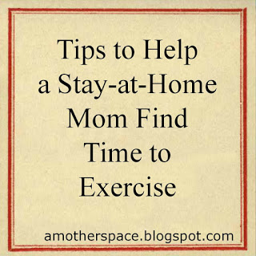
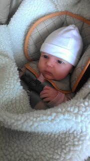

Exercising regularly with a newborn, a 2-year-old and a 3-year-old is challenging, to say the least.   
  
  

  
I'm no expert but I am starting to figure things out. I've put together some ideas of what has and what has not worked for me.  
  
**Waking up early** is tough for several reasons. I'm up nursing Little E throughout the night and so I'm tired. It's also difficult to juggle a nursing schedule around exercise first thing in the morning. It takes awhile to feed her and I also like to get showered and ready for the day before my husband heads off to work. _I know that this will get easier._ Running in the morning is my ideal workout time.  
**Nap time** isn't an optimal exercise time either. All 3 children rarely nap at the same time and when they do I feel like I need to get something accomplished (like laundry, cleaning or [writing tons of thank you notes](http://amotherspace.blogspot.com/2013/04/my-five-for-friday.html#.UWInrpNQGHg)!).   
  
Although, occasionally, I have been able to squeeze my strength training in during nap time. I even did it a couple extra times throughout the week!  
  
Last week on the mornings that we have stayed home it worked out to run on the **trea****dmill**. The two older children play in our family room downstairs (which is the same room that the treadmill is in) and I've found that the baby sleeps well, even with the noise of the treadmill.   
  
It also helps to have **backup**. My mom is able to come over occasionally after work to watch the kids while I go out and run. (Thanks, Mom!)  
  
My family also likes to **workout together**. At least my husband and I get a workout. We go on walks a lot in our neighborhood and occasionally at parks. We also have enjoyed going for family bike rides while pulling the bike trailer. We're glad that Little E likes being in her stroller! Here she is all bundled up for our walk on Friday evening.  
  

  
Now that I'm back to exercising regularly I'm making it work. Some days it happens and some days life gets in the way but that's how it goes. Being there for my family is most important and I try and work in as much exercise as I can.  
  
**How do you find the time to exercise?**  
  
  
Here's my exercise from last week:  
  
Monday:  
Strength Training  
  
Tuesday:  
1 mile treadmill run, .5 mile WU walk and .5 CD walk  
Strength Training   
  
Wednesday:  
2 mile run  
Strength Training  
  
Thursday:  
Rest  
  
Friday:  
1.5 mile walk  
  
Saturday:  
2 mile treadmill run  
Strength Training  
  
Sunday:  
Rest  
Weekly Mileage:   
5 Running Miles  
2.5 Walking Miles  
3 Strength Training Workouts  
  
  
  
  

\-------------------------------

  

Find A Mother's Pace on...  
  
Twitter [@amotherspace3](https://twitter.com/amotherspace3)  
  
Facebook [amotherspace3](http://facebook.com/amotherspace3)  
  
Instagram [amotherspace](http://instagram.com/amotherspace)  
  
Pinterest [amotherspace](http://pinterest.com/amotherspace/)  
  
Bloglovin' [A Mother's Pace](http://www.bloglovin.com/en/blog/6680087)  
  
RSS [amotherspace](http://feeds.feedburner.com/amotherspace)
