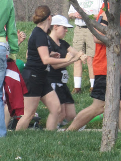
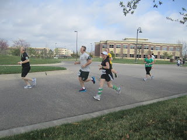
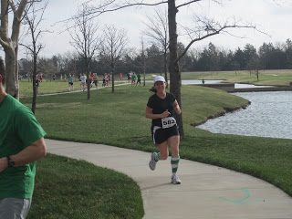
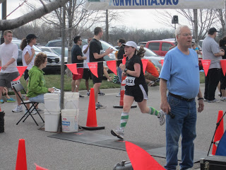
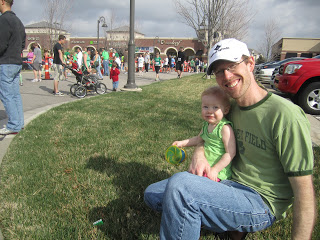
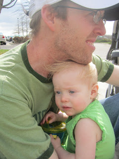
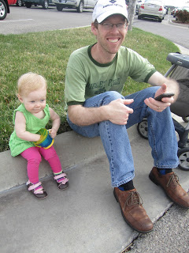
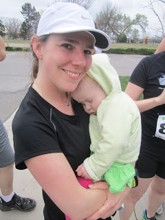
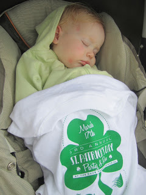

  
I think I was more nervous before this race than my first full marathon last fall. This was the first race that I had a time goal and I wanted to do more than just finish. I really wanted to get the 4 miles finished in 35 minutes.  
  
I decided to run in the St. Patrick's Day Party & Run 4 mile race because it was a fundraiser for the Leukemia and Lymphoma Society. I had originally wanted to do a 5K race at this point in my training but decided to throw in the extra mile for a good cause. I'm glad I did because it was a fun race.  
  
The race started at 10 a.m. and I'm not used to running at that point in the day. I was a little nervous about eating correctly. Usually before I run early in the morning I have homemade [protein bites](http://gimmesomeoven.com/no-bake-energy-bites/) but since the race was later I knew I needed a complete breakfast. C.J. made French Toast. Perfect! I also limited myself to 1 cup of coffee instead of my usual 2 and I had some water before we left the house.  
  
I got there early to pick up my packet and get ready to run. I met up with Kristie and Lamont before the race.  
  

 Before I knew it we were off. I have never used my Nike+ watch in a race before and I was worried that the GPS wouldn't link up in time so I started the sensor a couple of minutes early. I was planning on hitting 'start' as soon as I crossed the chip timer. Planning is the key word in that sentence. I hit start and my whole screen went blank! My fully charged watch just died on me. ARG!!!  

Yep, C.J. captured a pic of me FREAKING OUT because I am now super dependent on watching my pace while I run to stay on track. I yelled something about my pace and just took off running. It really threw me off because I was so worried that I would run too fast in the beginning and then not be able to have a strong finish.  

 I had calmed down a little in the middle of the first mile when C.J. took this pic. Evidently I run with my eyes closed. The course was really pretty. We ran through a developing neighborhood and on some roads around a shopping area.  

 It was a windy day here in Kansas...shocking, I know! I'm used to running in the wind so I wasn't that concerned about it. Around the 3 mile marker we had a straight run headed South directly into the wind. I kept repeating in my head "I can do it. The wind is not that strong. I run in the wind all the time. I can pass these people...." And I did, pass people that is, several of the people in front of me slowed way down for the wind and I \*think\* it makes me run faster. Maybe I would \*know\* it made me run faster if my watch was working!  

 C.J. snapped this one of me crossing the finish line. Both feet off the ground! The time said 36 something and I was pretty disappointed until I remembered that I was at the back when we started and my chip timing would be different. Official race time: 35:34. 34 little seconds from my goal time. I'll take it!  
  
Distance: 4 Miles  
Time: 35:34  
Pace: 8:54  
Placement: 140th out of 541  
Age Division (35-40): 9th out of 54  
  

 My wonderful husband and daughter cheered me on (and took fun pictures) during the race.

 Snuggling in to get out of the wind.

 Cheering on all the runners!

 Watching Mommy run 4 miles is tough work. 

