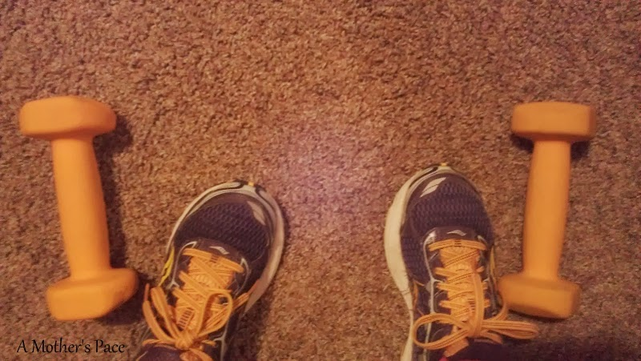
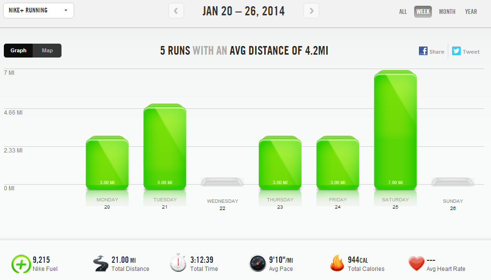

Last week was the week of strength training. Something clicked and I wanted to do it, so I did. I ended up doing 5 workouts and spending well over an hour on my strength for the week.   
  
  

  
I didn't give up any running but I did make some changes to make it happen. The biggest change was _making_ the time for strength _at the same time_ that I am running. I don't do a good job at fitting in double day workouts but it's also hard to have enough time for running and strength in the morning.  
  
The photo above is my [Instagram](http://instagram.com/amotherspace) post from my workout on Thursday. 15 minutes of core work followed by 3 miles of 400 repeats on the treadmill.  
  
I made it a priority this week and I crushed my goal of doing 2-3 strength workouts a week.  
  
  

  
I already feel stronger and I'm excited to keep this up during half marathon training starting soon.  
  
I also got on the spin bike again this week. It was shorter due to time limitations (30 minutes) but still felt like a quality workout.   
  
  
  

  
**Weekly Workouts**  
  
Monday: 3 miles (9:04 pace) +  25 minute Strength  
  
Tuesday: 5 miles (9:00 pace)  
  
Wednesday: Rest Day  
  
Thursday: 3 miles (9:05 pace) + 15 minute NTC Ab Burner  
  
Friday: 3 miles (9:02 pace) + 15 minute Strength: Arms and Core  
  
Saturday: 7 miles (9:27 pace) + 15 minute Strength: Legs and Core  
  
Sunday: 30 minutes Spin Bike (Climb Intervals) +10 minutes Core  
  
  
  

  

  

Total Running Miles: 21  
Weekly Average Pace: 9:10  
  
January Running Miles: 70.58  
2014 Running Miles: 70.58  
  
2014 Running Kilometers: 113.59  
  
  
  

**Do you strength train regularly? Do you exercise all at once during the day or break it up to fit it in?**

  

  

  

  

  

\-------------------------------

  

Find A Mother's Pace on...  
  
Twitter [@amotherspace3](https://twitter.com/amotherspace3)  
  
Facebook [amotherspace3](http://facebook.com/amotherspace3)  
  
Instagram [amotherspace](http://instagram.com/amotherspace)  
  
Pinterest [amotherspace](http://pinterest.com/amotherspace/)  
  
Bloglovin' [A Mother's Pace](http://www.bloglovin.com/en/blog/6680087)  
  
RSS [amotherspace](http://feeds.feedburner.com/amotherspace)
