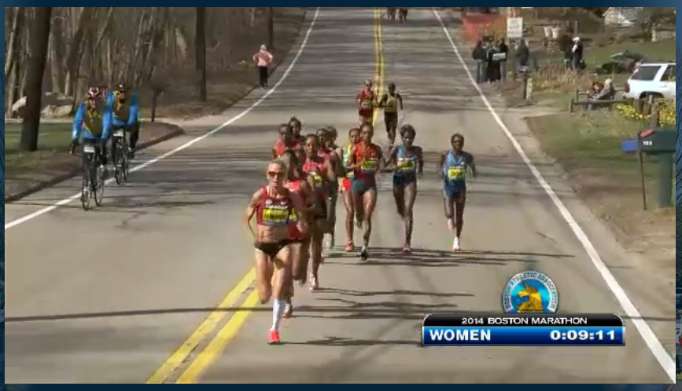
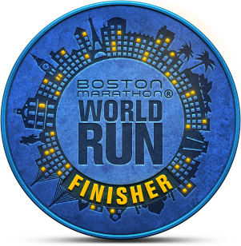
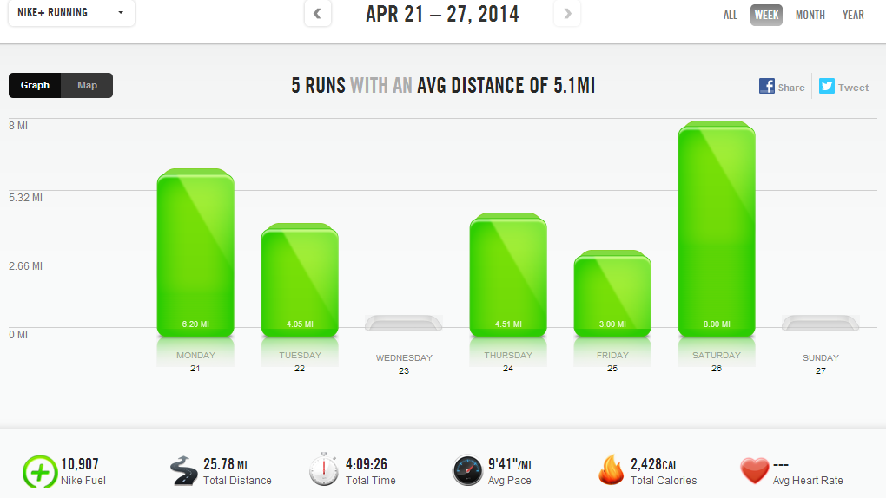

 

It's been a week since the Boston Marathon and, like many of you, I spent a good chunk of the day watching the runners on my laptop. It's such an inspiring race to watch and not only the elites but the every day people that crossed the finish line for hours. It was a dream come true race for so many people and it's that kind of inspiration that gives me motivation!

 

 

If you haven't read Shalane Flanagan's interview with Runner's World Magazine and you are curious about what she was thinking during the race, I would highly recommend taking a few minutes to read it. You can find it [here](http://www.runnersworld.com/boston-marathon/shalane-flanagan-ran-to-win). Shalane's race was spectacular. She was strong and determined and I wish it would have had different results for her but she left it all out on the course and did her best. I can't wait to see what she brings to Boston in the future!

And Meb, what can I say about Meb? He's amazing and the race was inspiring. Watching him cross the finish line was emotional for this girl (can I still call myself that?) from Kansas, watching on my laptop. I obviously have no connection to him other than the fact that we both share a love for running but to watch him win the Boston marathon is a memory I won't easily forget!

 

 

I ran my own race on Monday, a virtual run with the [Boston Marathon World Run](http://www.bostonmarathonworldrun.org/?flag=0). Over 13,000 runner's from all over the world pledged to run a total of 740,185 miles and then logged the miles after completing them. I pledged to run 6 miles but I really ran 6.2. If only I could have ran the 26.2 that all the Boston marathoners were running that day!

 

 

**Weekly Workouts**

Monday: 6.2 miles (9:50 pace)

Tuesday: 4.05 miles (9:24 pace)

Wednesday: Rest Day

Thursday: 4.51 miles (9:18 pace)

Friday: 3 miles (9:31 pace)

Saturday: 8 miles (9:58 pace)

Sunday: 30 minutes Spin Bike + 20 minutes core and arm strength

 

 

 

One of my main goals for 2014 is to Run This Year in kilometers. That's 2,014 kilometers or 1,251.44 miles.

Weekly Running Miles: 25.76

Weekly Average Pace: 9:41

April Running Miles: 97.42

2014 Running Miles: 408.07

2014 Running Kilometers: 656.73

 

 

**Did you participate in the World Run? Did you have any friends or family running the Boston Marathon?**

 

 

——————————-

Find A Mother’s Pace on…

Twitter [@amotherspace3](https://twitter.com/amotherspace3)

Facebook [amotherspace3](http://facebook.com/amotherspace3)

Instagram [amotherspace](http://instagram.com/amotherspace)

Pinterest [amotherspace](http://pinterest.com/amotherspace/)

Bloglovin’ [A Mother’s Pace](http://www.bloglovin.com/en/blog/6680087)

RSS [amotherspace](http://feeds.feedburner.com/amotherspace)
