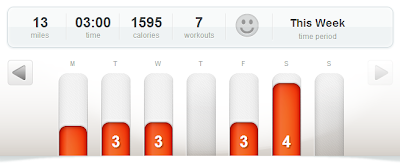

Early last Wednesday morning I was woken up by thunder. I listened to it for a little while before falling back asleep, wondering if I would be able to run outside after I woke up (again) or if lightning would keep me inside.   
  
I was pleasantly surprised to find clouds but no rain when I woke up. Out I went for a very enjoyable 3 miles. The first two miles I tried not to look at my pace and just enjoy a nice slow run. I think that backfired just a little because  it turned out to be a little slower than I had wanted. Oops! Then during the last mile I started strides that lasted about 100 meters each.   
  
  

  
After arriving home, my husband showed me how I narrowly missed two storm systems going through our area. Ha! I guess the weather came together in my favor!   
  

  

I'm reading "[The Runner's World Big Book of Marathon & Half Marathon Training](http://www.amazon.com/Runners-World-Marathon-Half-Marathon-Training/dp/1609616847/ref=sr_1_1?ie=UTF8&qid=1368045127&sr=8-1&keywords=the+runners+world+big+book+of+marathon+and+half-marathon+training)" right now in preparation for my next half marathon and hopefully future full marathons. Since I'm recently getting back into running after childbirth I found this information about rediscovering speed very useful.   
  
  

  
And that is why I decided to add strides to my workout last week. I really want some of my 'speed' to come back and in order for that to happen I need to work at it. I'm over the recommended two week easy running period but I started there anyway. I'm comfortable with the easy runs so now it's time to start adding in some structured workouts.  
  
  

  
Here's a quick look at my running from last week:  
  
Monday  
Sworkit Upper Body 10 minutes  
  
Tuesday  
3 miles  
Sworkit Abs 10 minutes  
  
Wednesday  
3 miles with strides  
Sworkit Lower Body 10 minutes  
  
Thursday  
Rest  
  
Friday  
3 Miles  
  
Saturday  
4 Miles  
  
Sunday  
Rest  
  
Total Running Miles: 13  
Total Walking Miles: 4  
  
  
  
How do you incorporate speed work into your running routine?  
  
Have you tried strides? Do you run them regularly?
