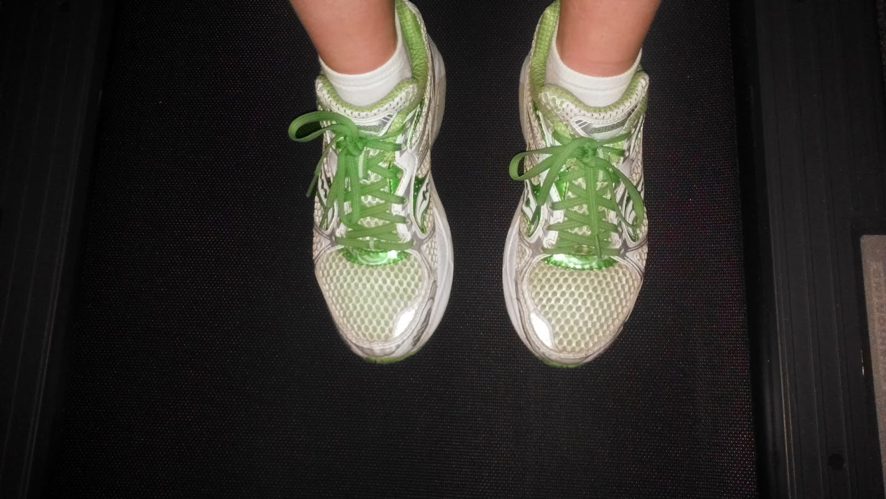
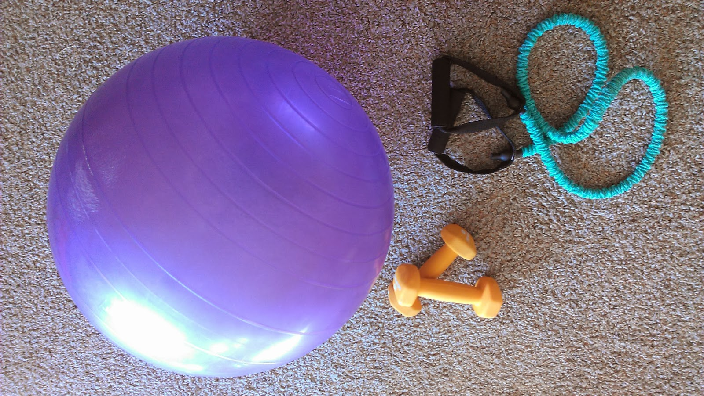

A Friday Five that is completely about running! I'm jumping right in today.

  

\[one\]

Yesterday, the news was announced that the Chicago Marathon was moving to a [lottery system](http://www.chicagomarathon.com/participant-information/registration/) this year. I'm more than a little disappointed because this was/is my goal race of the year. My sister lives in Chicago so it's an easier race for me for traveling purposes and I was just plain excited to run in a city that I love. I'm using the past tense already! I still have hope. I'm hoping to be one of the 45,000 people running the streets of Chicago on October 12th.

  

\[two\]

I recently decided that it's o.k. that I don't like running alone in the dark. I live in a nice neighborhood and I have nothing specific to worry about but I'm just not comfortable out all by myself. Why would I do something I love but not be comfortable? So, I'm running inside and I don't even look at the weather anymore to help make that decision. It does make the outside weekend runs all the more special, for sure.

  

  

\[three\]

I'm getting tired of the treadmill. Don't get me wrong, I'm so happy that I have it and I'm able to still run early in the morning before the day officially starts. But I'm ready to run outside again. I can't wait for the early morning light again.

  

  

\[four\]

That 'stop' button is all too easy to push on the treadmill but one way I'm getting around it is by adding in strength training in between the miles. Run a mile or two, jump off and do 10 minutes of weights and strength, jump back on for another mile. Jump off and do some more strength. It's definitely a win win because I'm fitting in my strength and the miles aren't as long.

  

  

\[five\]

Back to the Chicago Marathon again. If I don't get in, I still want to run a marathon in the fall. I can fall back on my local race, the Prairie Fire Marathon, which is a great race but I've already ran it before. So, do I pick another 'vacation' race or stick close to home? Decisions, decisions.

  

**Were you planning on registering for the Chicago Marathon? Have the new registration requirements/lottery system changed your mind? What is your back up race?**

  

  

\-------------------------------

  

Find A Mother's Pace on...  
  
Twitter [@amotherspace3](https://twitter.com/amotherspace3)  
  
Facebook [amotherspace3](http://facebook.com/amotherspace3)  
  
Instagram [amotherspace](http://instagram.com/amotherspace)  
  
Pinterest [amotherspace](http://pinterest.com/amotherspace/)  
  
Bloglovin' [A Mother's Pace](http://www.bloglovin.com/en/blog/6680087)  
  
RSS [amotherspace](http://feeds.feedburner.com/amotherspace)
