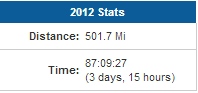

I was pretty lucky this morning. I was running down the street minding my own business when I noticed that I was way too close to a SKUNK! I'm pretty sure it's the closest I've ever been (and ever want to be) to a skunk.   

  

He was watching me.

  

I just kept running (much faster) right by hoping that he would know I wasn't a threat. I lucked out. As soon as I was past him he turned around and continued on his path. 

  

I would never, of course, _want_ to get sprayed by a skunk but I really can't imagine it during pregnancy. My sense of smell is so much stronger during pregnancy...I can't even imagine! 

  

I was a little freaked out for the remainder of my run and I'll be honest, I'm wondering if my morning run will ever be as relaxing as it was before this morning. 

  

I'm really not surprised that I saw the skunk, we practically live in the country, but I'm just not happy about it. I'm a city girl and not a trail runner. I'm not used to encounters with wildlife while I am out for a run. Yikes!

  

<table cellpadding="0" cellspacing="0"><tbody><tr><td></td></tr><tr><td>

Source:&nbsp;<a href="http://reasonstobefit.tumblr.com/">reasonstobefit.tumblr.com</a>&nbsp;via&nbsp;<a href="http://pinterest.com/russella/" target="_blank">Angie</a>&nbsp;on&nbsp;<a href="http://pinterest.com/" target="_blank">Pinterest</a>

 

</td></tr></tbody></table>

Today was the second time that I woke up to run early this week. On Tuesday, I enjoyed a beautiful morning. It was cool but not cold. Breezy but not windy. And the stars! The stars were beautiful! I absolutely love running under the stars. 

  

This morning I ran under the stars as well but I didn't enjoy it nearly as much. Between the skunk scare, the much cooler weather and the crazy wind, I didn't really notice the stars quite like I did on Tuesday. 

  

  

I crossed the 500 mile mark for the year! I've been running off and on for most of my life but I've only started recording mileage in the past couple of years. 500 miles in 1 year is a record for me and I've been pregnant for the majority of it! Now I can't wait to see how many I log in the final 2.5 months of the year.
