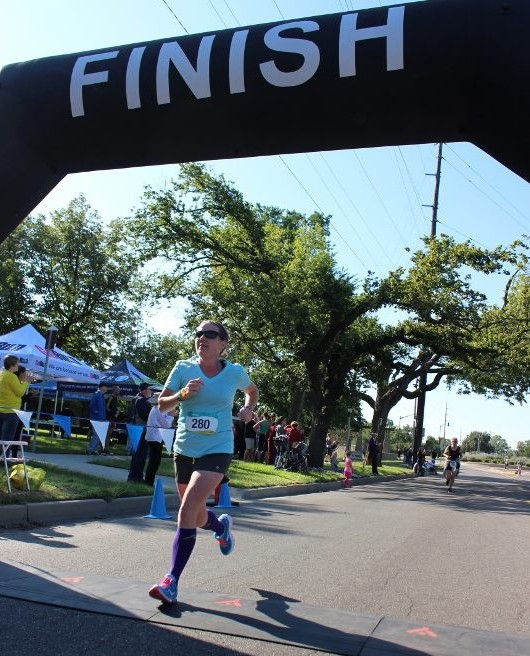
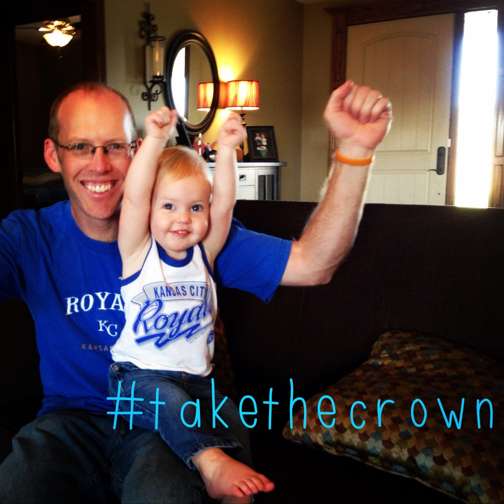

 

Recently I've ran a few PRs (Personal Records) and I've had a lot of people ask how I did it. I took 40+ minutes off of my marathon time a couple of weeks ago. My first marathon time was 5:04:52 in 2011 and on October 12th of this year I ran it in 4:22:54. But even more noticeable, I shaved 5+ minutes off of my half marathon time about 6 weeks ago. I finished 13.1 miles in 1:57:02 and finally met my sub 2 hour goal that I had been chasing. Just a month earlier I had set my half PR at 2:02:37. My very first half marathon was in 2007 and I ran it in 2:17:55.

 

\[caption id="attachment\_2881" align="aligncenter" width="530"\] Feeling strong at the end of my recent half marathon PR.\[/caption\]

 

So what has changed with my running?

A few things.

- I kept running a steady amount in between races. I had a good running base going into my races.
- I picked a plan that I was comfortable for me but challenging at the same time.
- My plan included speed work. You have to run faster to run faster.
- My plan included a lot of miles. I added the mileage in gradually and worked from the base I had already built.
- I worked on the mental side of running.

By far the most important --and new to me-- skill listed above is working on the mental side of running. I've ran races in the past where I am questioning why I signed up for the race _the entire time I am running._ I would run and make deals with myself that I would never have to sign up for another race again. I would notice my pace slipping and make excuses and negative talk would take over in my head.

Racing didn't seem to be something that I enjoyed because of how I was thinking during the race. I enjoyed the idea of racing but when the toughness of the race set in my mind was not in the game at all.

At some point this summer I purchased the book "[Mind Gym](http://amzn.to/1tZYorK)" by Gary Mack with David Casstevens. (affiliate link) This book was my first look into mental preparation for running and I firmly believe that it helped me improve my running enough to make some key PRs in recent races.

 

\[caption id="attachment\_2880" align="aligncenter" width="463"\] Our Royals made it to the World Series!\[/caption\]

 

The author has worked with a lot of baseball players over the years and so the baseball references throughout the book didn't hurt anything for this baseball fan. But even if you aren't a baseball fan I think that this book can help a runner drastically. I can tell you the gist of the book but there's just something about reading it for yourself and even rereading it that will be beneficial. I should also say that I purchased the book on my own and have no tie to the authors. I just wanted to share my secret!

Basically the idea behind the book is to believe in yourself and visualize yourself in every aspect of your race or even a tough workout. Visualize difficulty, visualize feeling good, visualize the finish line. Spend time visualizing little details and even details you can't control, such as different types of weather because it can all affect your race. Visualize yourself running, glancing down at your wrist to see the pace you want to hit on your watch.

Before both of my races I spent a good amount of time thinking about my race beforehand. Visualizing the pace that I wanted to hit. Usually I would spend a few minutes before bed or maybe during nap time while the kids were sleeping in the afternoon. Before the Chicago Marathon I was driving to Chicago and literally spent hours thinking of the turns on the map, the pace I wanted to run, the crowds of people and smiling while running.

I would do the same before long runs or a hard speed workout as well. I would also practice during a long run, especially if I was hitting the pace that I wanted. I would imagine that I was racing in Chicago and hitting my pace as well.

It's hard to explain how confident this made me before race day. I had was not nervous before either race in the slightest. I felt excited and ready to race on both race day mornings.

So that's it, that's my secret. The mental side of running is the key to improving running and earning a PR!

 

 

Read my race recaps from my recent PRs: [Johnston's Half Marathon Race Recap](http://amotherspace.net/2014/09/johnstons-half-marathon-race-recap/ "Johnston’s Half Marathon Race Recap") & [Chicago Marathon Race Recap](http://amotherspace.net/2014/10/2014-chicago-marathon-race-recap/ "2014 Chicago Marathon Race Recap")

 

\_\_\_\_\_\_\_\_\_\_\_\_\_\_\_\_\_

I’m running I ran the Chicago Marathon with Team RMHC!

To find out more read my post about [Running for Charity](http://amotherspace.net/2014/06/the-chicago-marathon-running-for-charity/) or head over to my [fundraising page](http://www.kintera.org/faf/donorReg/donorPledge.asp?ievent=1097960&supId=399266070) to make a donation.

——————————-

Find A Mother’s Pace on…

Twitter [@amotherspace3](https://twitter.com/amotherspace3)

Facebook [amotherspace3](http://facebook.com/amotherspace3)

Instagram [amotherspace](http://instagram.com/amotherspace)

Pinterest [amotherspace](http://pinterest.com/amotherspace/)

Bloglovin’ [A Mother’s Pace](http://www.bloglovin.com/en/blog/6680087)

RSS [amotherspace](http://feeds.feedburner.com/amotherspace)
