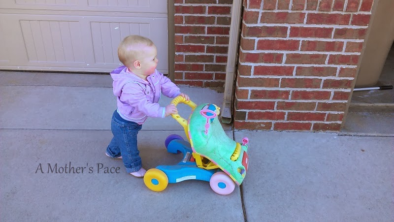
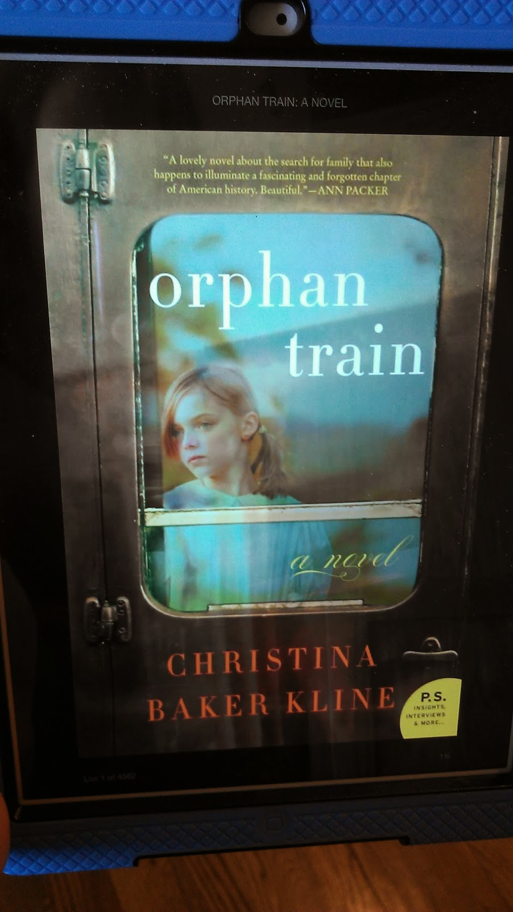
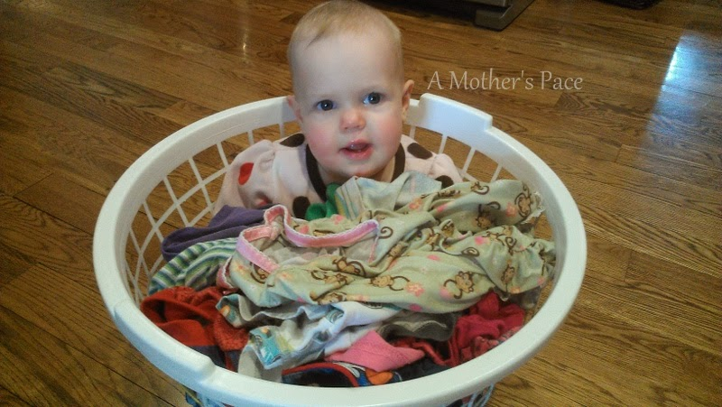
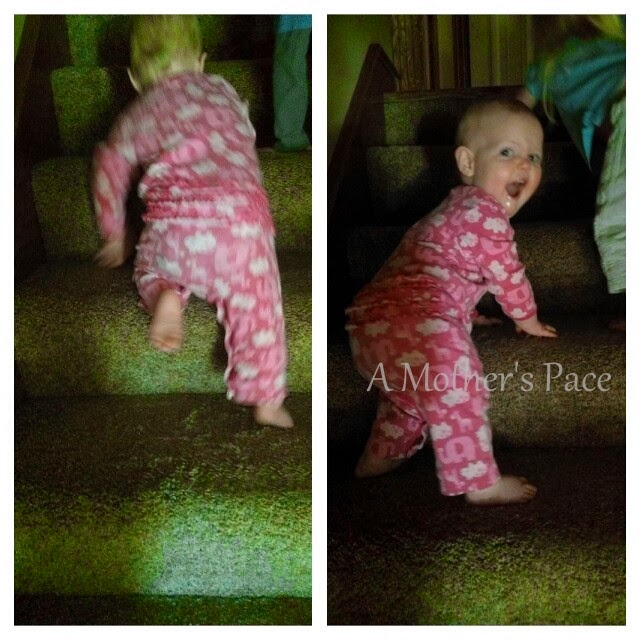
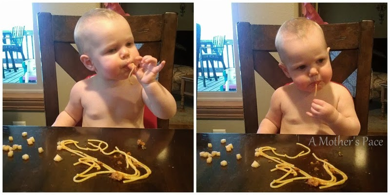
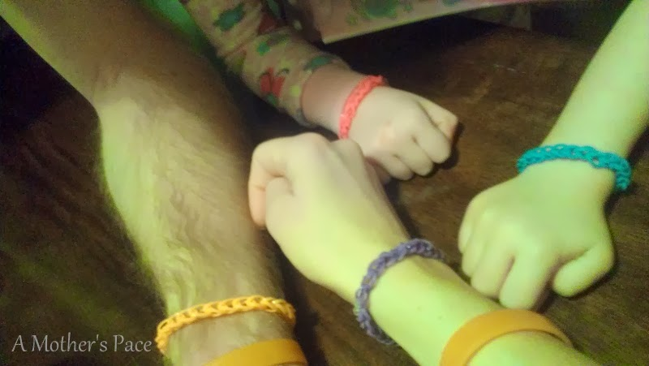
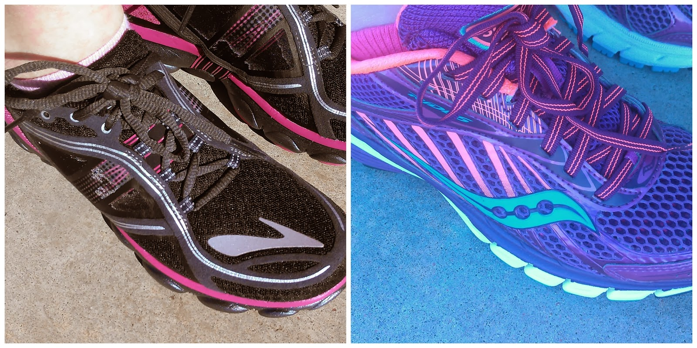
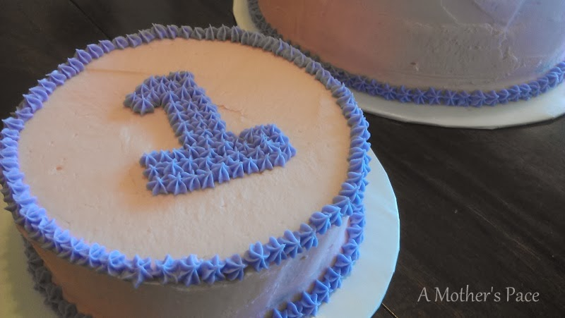
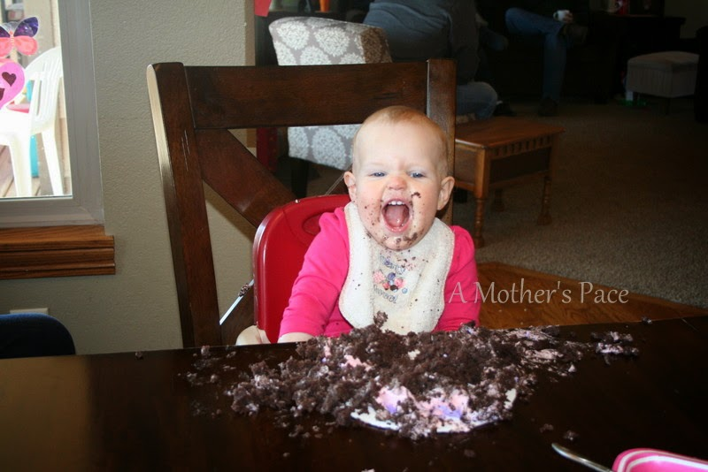

It's Thursday and this week that means I'm thinking out loud and sharing a few random thoughts that are rolling around in my head.  
  

  
Little E is walking. She loves to be on her feet and most of the time that means behind a walker but she's taken about 8 steps at a time on her own. She's so proud when she walks and always has a huge smile on her face.   
  
  

  
I'm currently reading "[The Orphan Train](http://amzn.to/1k9VsmJ)" by Christina Baker Kline. It's historical fiction about something I didn't even know existed. I'm almost half way through it right now and and so far I'm enjoying it.  
  
  

  
One of my favorite laundry helpers. She likes to go from room to room picking up laundry with me and then riding the basket to the laundry room.  
  
  

  
These stairs are a favorite activity. We could seriously go up and down these all day long.  
  
  

  
Little E's favorite meal right now is pasta. Or one of her favorites, she's a really good eater. She loves to suck the pasta in and it's pretty cute to watch.  
  
  

  
My niece sent us these bracelets for Valentine's Day. It's currently my favorite accessory!   
  
I just realized I have no thoughts about running, yet, in this post! I'm currently breaking in two pairs of shoes. The Brooks Pure Flows and Saucony Ride 6's. The Saucony's are my all time favorite shoe but when I tried on the Pure Flows, I couldn't resist. I like to rotate shoes and I was due for two more shoes anyway. The Pure Flows are a lower drop so I'm adding them in a mile at a time. I'm liking them a lot so far!  
  
  

  
Yes, this was a little heavy on Little E but I can't help myself. She turned 1 (!!!) this week and I'm having fun documenting her personality right now.  
  
  

  
And, in case you missed it. She thoroughly enjoyed and destroyed her smash cake. So. Stinkin'. Cute.  
  
  

  
  
  

**What are you reading right now?**

  
  

  

  

  

  

\-------------------------------

  

Find A Mother's Pace on...  
  
Twitter [@amotherspace3](https://twitter.com/amotherspace3)  
  
Facebook [amotherspace3](http://facebook.com/amotherspace3)  
  
Instagram [amotherspace](http://instagram.com/amotherspace)  
  
Pinterest [amotherspace](http://pinterest.com/amotherspace/)  
  
Bloglovin' [A Mother's Pace](http://www.bloglovin.com/en/blog/6680087)  
  
RSS [amotherspace](http://feeds.feedburner.com/amotherspace)
