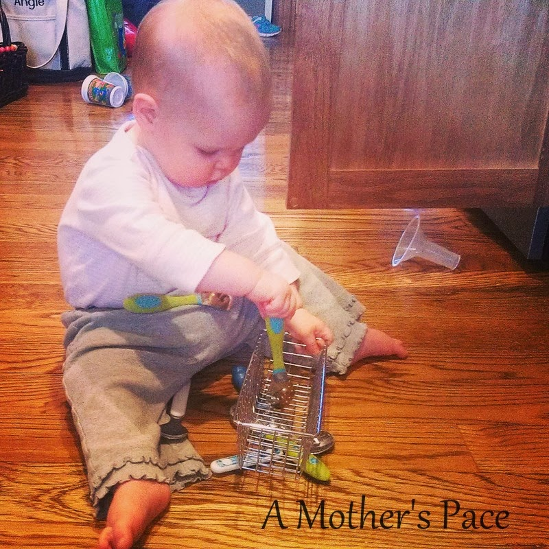
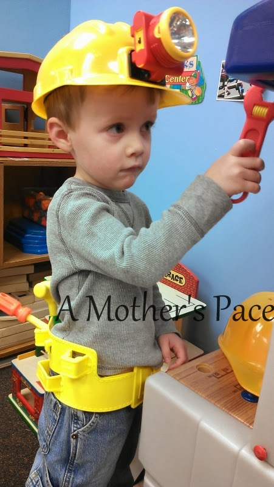

Just a few random thoughts as I'm [Thinking Out Load](http://runningwithspoons.com/) on this Thursday.   
  

Instagram is great for recipes. Sometimes I just take a screenshot to save the recipe for later. This one from Jamie sounds delicious and I will be making it soon!  
  
I'm really enjoying having a set schedule for workouts again. I'm not officially training yet but I'm trying to get into a schedule so I won't be in shock when it does start in a couple weeks. This means at this point I do similar workouts, just easier than the actual training plan. Right, now I'm getting used to Sundays as a cross training day, Mondays as a run + strength day, etc.  
  
We bought an iPad recently and it may have just converted this Android girl over to an iPhone. Of course, it will be awhile before I'm ready to switch phones (almost a year!!) but that's what I'm leaning towards right now.  
  
I'm still reading listening to "[Beautiful Ruins](http://amzn.to/1b3XV9g)" on Audible. I'm slightly worried because I have about 6 hours left and my book club meets on Monday. Yikes! I'm enjoying it though. I listen while running (of course) but also when I fold laundry and do other chores while the kids are sleeping.  
  
Have I mentioned that this little girl is so much fun right now? She's into everything.  
  

  
Didn't you know that spoons and a basket are one of the best toys ever???  
  
And she's walking all over the place. She's SO CLOSE to being able to walk all by herself. Right now she just takes a couple of steps and she's so proud. (So am I!)  
  

  
I've started to bring my computer into the bedroom while my kids nap. Little A is on a nap time strike (UGH!) and _so__metimes_ it helps if I am in there to make sure she's not just goofing around instead of relaxing. It wouldn't be that big of a deal if she wasn't such a bear later on in the day after a missed nap. Lately nap time is my least favorite time of the day.   
  
Also, Little E has basically given up her morning nap. I'm NOT ready for that to happen and I'm not sure when the other two kiddos stopped their morning naps. Needless to say, I'm not getting a lot accomplished during nap times lately.  
  
And just because I feel as though this post needs photos of my other two children, here's one of Little A thoroughly enjoying some chocolate chip banana bread.  
  

  
And Little O playing at school.  
  

  
  
Don't forget to check out my [GIVEAWAY](http://amotherspace.blogspot.com/2014/01/powered-by-bits-review-and-giveaway.html#.Ut__sfTnarf) going on this week!  
  
  

  
  

**Android or iPhone user? Do you listen to audio books? If so do you have any suggestions for me?**

  

\-------------------------------

  

Find A Mother's Pace on...  
  
Twitter [@amotherspace3](https://twitter.com/amotherspace3)  
  
Facebook [amotherspace3](http://facebook.com/amotherspace3)  
  
Instagram [amotherspace](http://instagram.com/amotherspace)  
  
Pinterest [amotherspace](http://pinterest.com/amotherspace/)  
  
Bloglovin' [A Mother's Pace](http://www.bloglovin.com/en/blog/6680087)  
  
RSS [amotherspace](http://feeds.feedburner.com/amotherspace)
