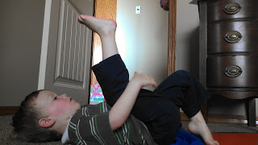

  
A few days ago a friend of mine, a fellow runner, asked me about stretching. She is new to running and her knee is hurting. She was wondering what I did to stretch before/after running and also if I thought it might help her knee pain.   
  
  

_(Disclaimer: I am not a doctor and these opinions are my own. Please ask your doctor before changing your exercise routine.)_

  

Just recently I wrote about my [**new post run stretching routine**](http://bit.ly/15ci8w6). It's still my favorite way to stretch after a run and I shared this with my friend. Later, this conversation got me to thinking more about stretching in general and I looked into it a little more.  
  
Typically, the only time I stretch before running is if something feels really tight or I am waiting for the satellites. Sometimes satellites can take forever! After running still varies. Anything from a couple of unstructured minutes to 15 minutes of following a set plan. (Here's the **[link](http://bit.ly/15ci8w6)** to my plan again.) This really isn't based on what I think my body needs, it is purely based on the amount of time that I have.   
  
The biggest problem with knowing when and how much to stretch is that the research is all over the place. Do a google search and you'll see what I mean.  
  
There are those that claim stretching before a run without warming up muscles can damage them. Others swear by stretching before a run to help ease them into the run.   
  
I think that stretching after running is more commonly accepted. Many runners will say that they need to stretch post run more often. And still others have a strict routine that they follow after every single run.   
  
The information on [**Ask Well**](http://nyti.ms/15coKKE) (from the New York Times) was helpful. The article addressed the stretching issue and came to the conclusion that stretching may be beneficial. It also said that stretching may be helpful if you _think_ it is helpful. Maybe that is why there is no standard for stretching before or after running. _It's really up to the individual runner and what a person thinks feels best._  
  
My post run stretching sessions are always better if I have company. I love seeing them take an interest in exercise!  
  
  

  

  
  
  
Do you stretch before or after a run?   
  
  
  
  
  

\------------------------------------------

  

  
Find A Mother's Pace on...  
  
Twitter [@amotherpace3](https://twitter.com/amotherspace3)  
  
Facebook [http://facebook.com/amotherspace3](http://facebook.com/amotherspace3)   
  
Instagram [amotherspace](http://instagram.com/amotherspace)  
  
RSS [amotherspace](http://feeds.feedburner.com/amotherspace)
