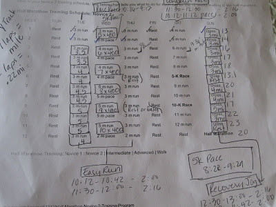
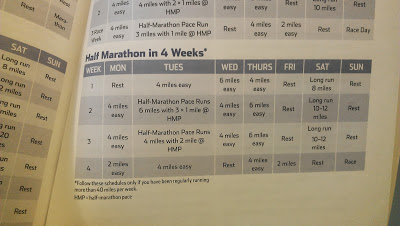

A couple of weeks ago when I went to the [kick-off party](http://bit.ly/13jqwEH) for the Fall season of Team in Training I was pretty surprised to find out that their training plans for a September 14th race had already begun. That's an 18 week training plan!  
  
I've always used slightly modified versions of [Hal Higdon's training plans](http://bit.ly/13jrgcW) and so I'm used to a 12 week plan. Quite a difference!  
  

I've been looking forward to planning out my training for awhile now. Things have been busy and I haven't actually gotten around to it yet. But I really like that stage of training, the planning stage.   
  
  

<table align="center" cellpadding="0" cellspacing="0"><tbody><tr><td></td></tr><tr><td>My half-marathon plan from my last race.</td></tr></tbody></table>

At first I was a little flustered, thinking that I was behind in the fact that I hadn't decided on my training yet. (I decided long ago that I would do my own training and not follow the plan that Team in Training provided.) But then I realized that I didn't have to have my 'plan' yet because I could still do my typical 12 week plan and have a few weeks to figure it out.  
  
So, what to do until then? I'm going to stick to the Team in Training plan until my Hal Higdon plan starts. Six weeks of the Team in Training plan will help to build my base before I start with my actual half marathon training plan. That gives me about 3.5 weeks to figure out exactly what my plan is going to be.   
  
I've not only signed up to run a September half-marathon but I am also running a half-marathon with Team in Training in October. While I have done a half-marathon and then a marathon several weeks later, I've never ran two half marathons this close together before.   
  
I want to do well in both of them.   
  
Lucky for me, I noticed that [The Runner's World Big Book of Marathon and Half-Marathon Training](http://amzn.to/10JdLRL) has a solution for me.   
  
  

  

It's a plan to train for another half-marathon 4 weeks after the first one. Perfect! I will probably modify this plan a little, of course. I haven't quite gotten there yet but I'm happy to have found a good model to base my training on.   
  
I'm so excited to be training for a race again!  
  
  
  

**Do you write your own training plans? If not where do you get your plans from? How long does your training for a half-marathon usually last?**

  

  

  
  

\------------------------------------------

  

  
Find A Mother's Pace on...  
  
Twitter [@amotherpace3](https://twitter.com/amotherspace3)  
  
Facebook [http://facebook.com/amotherspace3](http://facebook.com/amotherspace3)   
  
Instagram [amotherspace](http://instagram.com/amotherspace)  
  
RSS [amotherspace](http://feeds.feedburner.com/amotherspace)
