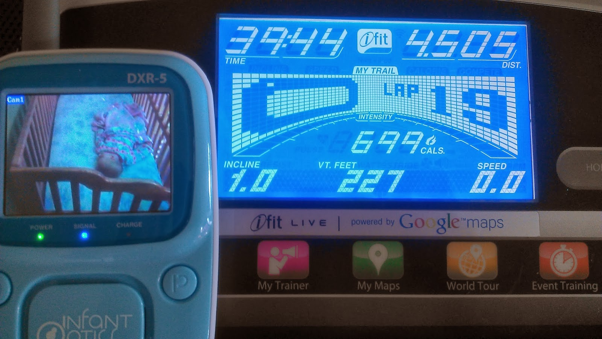
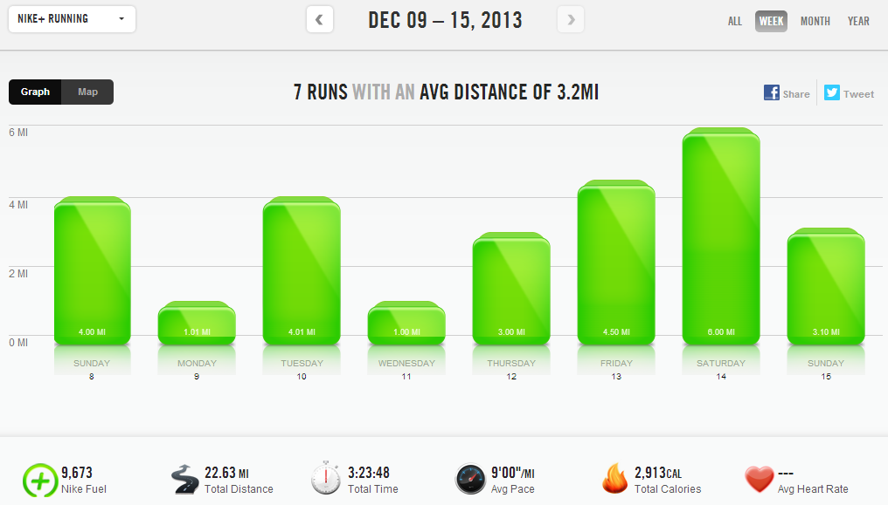

 It's been a great week of running to keep the streak alive. I only ran outside two out of the past seven days. I don't mind my treadmill at all when I think about running outside in the early morning cold and darkness.   
  
_I almost look forward to the treadmill._  
  
I've listened to podcasts a few times this week and I'm catching up on my Netflix shows. I get to wear shorts and don't have to spend time layering up and then washing all the layers later on.   
  
A treadmill means I can run during nap time. (At least when it works out.) This week I ran 5 400 repeats during my Little E's morning nap. The two big kids and I went downstairs. The kids played and I ran. I needed a mile for the streak, I wanted 3 for a good workout and I ended up with 4.5 because nap time lasted so long. I was able to shower and eat lunch before she woke up. _What???_   
  

  
Yes, I'm definitely loving the treadmill this winter. And we don't even have snow yet. I'll be outside for that run, that first snowy run of the year.   
  
  
  

  
**Weekly Workouts**  
  
Monday: 1.01 miles (8:42 pace)   
  
Tuesday: 4.01 miles (9:44 pace)  
  
Wednesday: 1 mile (7:40 pace) + Strength  
  
Thursday: 3 miles (9:14 pace)  
  
Friday: 4.5 miles (8:49 pace)  
  
Saturday: 6 miles (9:01 pace)  
  
Sunday: 3.1 miles (8:39 pace) + Strength  
  
  
  

  
  
Total Running Miles: 22.62  
Weekly Average Pace: 9:00  
  
December Running Miles: 47.15  
2013 Running Miles: 554.21  
  
  
  

**Did you run on the treadmill this week?**

  
  

\-------------------------------

  

Find A Mother's Pace on...  
  
Twitter [@amotherspace3](https://twitter.com/amotherspace3)  
  
Facebook [amotherspace3](http://facebook.com/amotherspace3)  
  
Instagram [amotherspace](http://instagram.com/amotherspace)  
  
Pinterest [amotherspace](http://pinterest.com/amotherspace/)  
  
Bloglovin' [A Mother's Pace](http://www.bloglovin.com/en/blog/6680087)  
  
RSS [amotherspace](http://feeds.feedburner.com/amotherspace)
