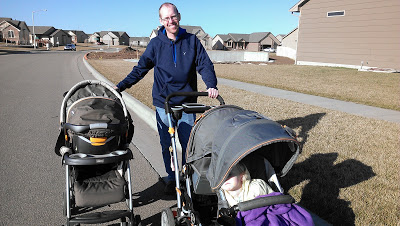
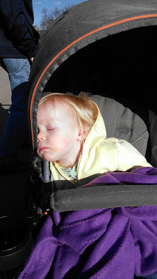
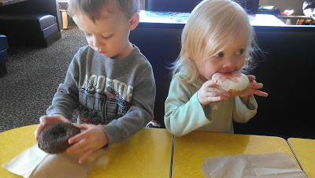
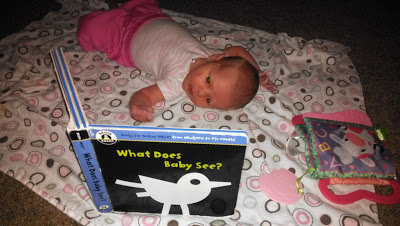
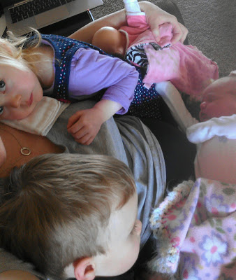
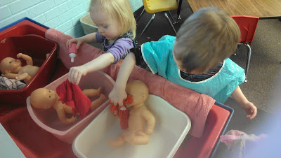

Everything came together last night and we ended up going for an evening walk! With the time change it is now light enough for an after work walk. It was a beautiful, warmish evening and I finally felt well enough for walking. So we loaded up two strollers worth of children and headed out.   
  

  
We walked a mile in our neighborhood and I enjoyed every second. It's amazing how much you appreciate something when you haven't been able to do it for so long.   
  
Little A was so excited to go on the walk but didn't last very long. She missed her nap earlier in the afternoon and so the stroller pretty much put her right to sleep.   
  

  
It looks like spring is arriving this week so hopefully we'll be able to keep up with our evening walks. As much as I want to start walking (really, running) on the treadmill, I think that it is better to wait a little while longer and just enjoy a few days of these evening walks together as a family.  
  

\_\_\_\_\_\_\_\_\_\_\_\_\_\_\_\_\_\_\_\_\_\_\_\_\_\_\_\_\_\_\_\_\_\_\_

  
A few highlights from our week.  
  

  
Donuts for a special treat.  
  

  
Little E already loves to read... or look at black and white pictures, really.  
  

  
Serious snuggling after nap time.  
  

  
And maybe the most favorite of all, washing babies at school.
