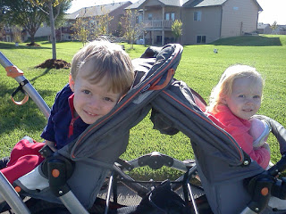

Rest days from running mean that we try to fit a walk in to our busy schedule. If we are home during the morning then the kids and I try to get out for at least 30 minutes. The cooler fall weather makes this so nice! Today we bundled up with jackets and blankets and braved the cold wind. Oh, and we usually have at least 1 baby with us, today we had 4! 35 minutes later we were home again and all felt refreshed!

  

We might head out again tonight after my husband is off work. It's a great way to catch up on our day and get a little exercise in before dinner. 

  

<table align="center" cellpadding="0" cellspacing="0"><tbody><tr><td></td></tr><tr><td>A couple of my favorite walking partners.</td></tr></tbody></table>
