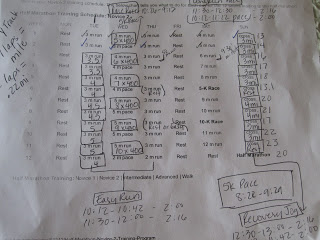

  

<table align="center" cellpadding="0" cellspacing="0"><tbody><tr><td></td></tr><tr><td>Here is a look at my outdated training guide. It needs to be updated now that my times have changed after my 4 mile race a couple of weeks ago. It's a pain to look it up online every time I need to know my goal &nbsp;pace before I head out for a run!&nbsp;</td></tr></tbody></table>

  
  
Before I get to week 8, here is what happened in week 7:  
  
  
Monday   

- Goal: 3 to 4.5 miles (easy 10:38-11:08 pace)
- Actual: 4.22 miles @ 10:34 pace

Tuesday  

- Goal: Strength and 3 miles (easy 10:38-11:08 pace)
- Actual: Strength & 3 miles @ 10:55 pace

Wednesday  

- Goal: 8x400 meters (with warm up, cool down and slower intervals it will end up being about 5 miles) (Intervals 9:05-9:23 pace)
- Actual:5 miles @ 8:51 pace (I ran inside on the Y track due to weather. Kept track of time with my stop watch and counted laps to get mileage and intervals. NOT FUN!)

Thursday  

- Goal: 3 miles (easy 10:38-11:08 pace)
- Actual: 3 miles @ 10:42 pace

Friday  

- Goal: Strength
- Actual: Strength

Saturday  

- Goal: 9 miles (long 10:38-11:38 pace)
- Actual: 9 miles @ 10:22 pace

Sunday   

- Goal: 3-4 miles (recovery 11:38-12:08 pace)
- Actual: 4 miles at 10:53 pace

Other than running a little too fast with a few runs I was right on track.  
  
  
Here is what I am hoping to accomplish in week 8 of training.  
  
  
Monday: Rest (done)  
Tuesday: 4 miles easy (10:38-11:08 pace) (done @ 10:37 pace)  
Wednesday: 5 miles tempo (9:12-9:36 pace)  
Thursday: 3 miles easy (10:38-11:08 pace)  
Friday: Strength  
Saturday: 10 miles long (10:38-11:38 pace)  
Sunday: 4 miles recovery (11:38-12:08)  
  
  
This  week I also signed up for the Girls on the Run 5K in May. I hope to set a new PR!
