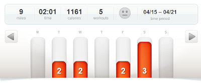
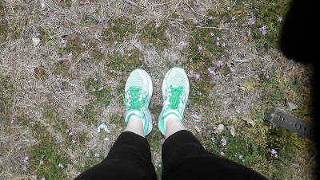
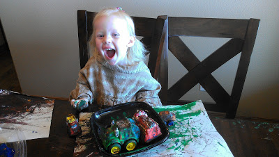
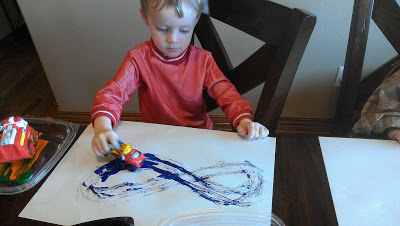
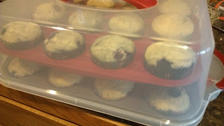
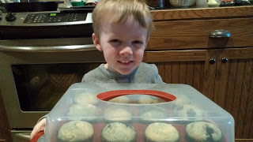
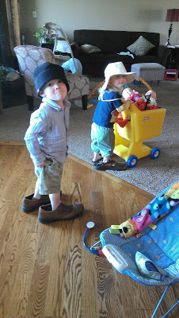

Three of my four runs were outside last week. I didn't have the best weather conditions but I was still glad to be outside running, even if it was through the cold, rain and wind.

  

  

I upped my mileage just a little. The **[3 miles on Saturday](http://amotherspace.blogspot.com/2013/04/a-bad-mothering-moment-and-my-long-run.html)** were windy but felt good. This week I'm hoping to get one 3 mile run in during the week and then push the Saturday run up to 4 miles. 

  

  

I'm getting excited for 'racing' season. I have two 5K's coming up in May. I also just signed up for two half marathons in the Fall. That means official training isn't too far away!  
  
  
Last week was transportation week at school. It reminded me that I used to let my preschoolers paint with cars back when I was a teacher. Let's just say it was a big hit! Little A sat at the table and painted for over an hour.  
  
  

  

  

And even though Little O didn't last as long, he still loved it. He even made an 8. 
  
Little O was also in charge of snacks for the week. We made a delicious batch of homemade blueberry muffins. I've been a mom for over 3 years but something about this 24 muffin holder full for school made me think, wow, I'm a mom! :)   
  
  

  

  
I stumbled upon this silliness the other day. I love that they play so well together!  

  

  

I'll leave you with a smile.  
  
  

  

Have a great Wednesday!
