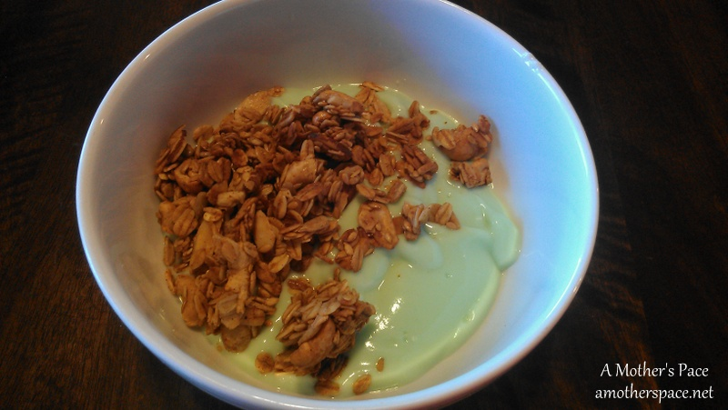
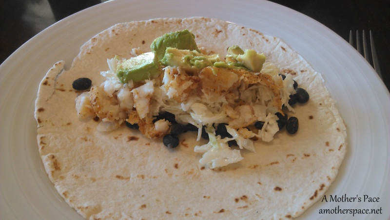
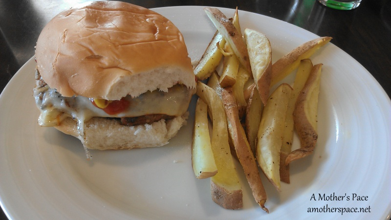

March Madness, weekend errands, running and family time has filled up our weekend. It's been a hectic one so I'm jumping right in today with some photos of meals from last week and then our meal plan for next week.

\[breakfast\]

Due to lack of planning on my part we ended up with green yogurt and granola on St. Patrick's Day. The kids thought it was fun though so it was alright. Next year I'll be more creative.

 

 

\[lunch\]

I enjoyed a snack plate recently for lunch. It was fun to eat a variety of foods and very filling. Hard boiled eggs are so good. I don't know why I don't make them more often.

 

 

\[dinner\]

[Tilapia Tacos](http://www.tasteofhome.com/recipes/tilapia-tostadas), one of my favorites. I never imagined that I would like fish tacos until I tried them and now it's something we make often and enjoy.

 

 

\[dinner\]

Spring is here and that means that we're grilling out again. I enjoyed a burger after my long run on Saturday and we also grilled out more food for upcoming meals this week. And when I say 'we,' I mean my husband. He's the one that grills in our family. Nothing complements a good burger more than a side of sweet potato fries!

 

 

And that brings us to next week. Here's what I have on our meal plan for the week.

**\[monday\]** Frittata

**\[tuesday\]** Grilled Sundried Tomato Sausage

**\[wednesday\]** Leftovers

**\[thursday\]** Sweet Potato Topped with Chili

**\[friday\]** Black Bean and Sweet Potato Tacos

**\[saturday\]** Grill Out

**\[sunday\]** Slow Cooker Chicken with Rice Pilaf

 

**Is your weekend busy or relaxing? What's something that you have planned for dinner this week?**

\-------------------------------

Find A Mother's Pace on...

Twitter [@amotherspace3](https://twitter.com/amotherspace3)

Facebook [amotherspace3](http://facebook.com/amotherspace3)

Instagram [amotherspace](http://instagram.com/amotherspace)

Pinterest [amotherspace](http://pinterest.com/amotherspace/)

Bloglovin' [A Mother's Pace](http://www.bloglovin.com/en/blog/6680087)

RSS [amotherspace](http://feeds.feedburner.com/amotherspace)
