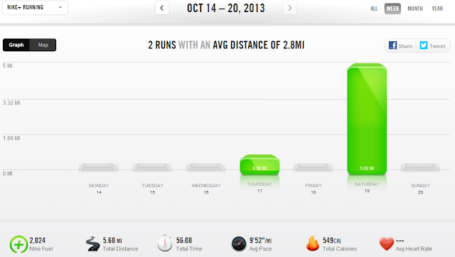

Saturday was our first weekend day since June that my husband or I didn't have to wake up early to head out on a training run. It was wonderful. Not that I slept in that much later though. My daughter woke me up at 6:30. At what age to kids start sleeping in??? I can't wait.  
  
We enjoyed pancakes for breakfast and then mid-morning I headed out for a run. It was my first real run since my half marathon. I had tried to run on Thursday but had cramping in my calf so I turned around and headed home to make for a very short run.  
  

After training for months and paying attention to pace, distance and how my body felt during almost every run it felt fantastic to go out and just run. It should have been one of those runs where I left my watch at home but I am a numbers girl and I like to have the data on my Nike+ account.  
  
As I was running on a normal route I decided to turn into a neighborhood that I don't typically run in. It was a beautiful area. I need to explore more often and not have a route planned out ahead of time.  
  
The leaves have started to fall here so I crunched a few on my way back to the house. It ended up being a pleasantly chilly easy run. Fall is definitely my favorite running season and running is my favorite way to enjoy fall.  
  

  

  
  

  
**Weekly Workouts**  
  
I took a bit of a break from running this week after training for months for a half marathon last weekend.   
  
Monday: Rest  
  
Tuesday: Rest  
Wednesday: Rest   
  
Thursday: .68 miles {Ouch, Right Calf Cramping!}(10:49pace)  
  
Friday: Rest  
  
Saturday: 5 easy miles (9:45 pace)  
  
Sunday: Rest  
  

  

  
Total Running Miles: 5.68  
Weekly Average Pace: 9:52  
  
October Running Miles: 50.12  
2013 Running Miles: 428.06  
  
  
  

**What is your favorite running season? And, seriously, when do kids start sleeping in???**

  

\------------------------------------------

  

Staying at home with kids sounds easy, right? Life with 3 little ones is busier than I imagined. I don't write every day on the blog but I do update Facebook, Twitter and Instagram more often.   
  
Find A Mother's Pace on...  
  
Twitter [@amotherspace3](https://twitter.com/amotherspace3)  
  
Facebook [amotherspace3](http://facebook.com/amotherspace3)  
  
Instagram [amotherspace](http://instagram.com/amotherspace)  
  
Pinterest [amotherspace](http://pinterest.com/amotherspace/)  
  
Bloglovin' [A Mother's Pace](http://www.bloglovin.com/en/blog/6680087)  
  
RSS [amotherspace](http://feeds.feedburner.com/amotherspace)
