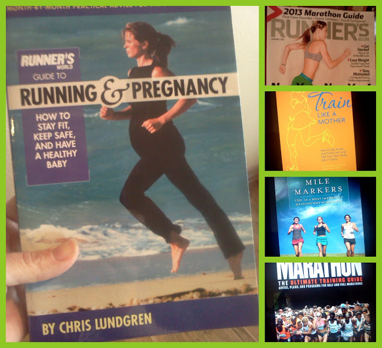

My pregnancy has taken over and I'm not running as much as I had hoped at this point. My priority has to be the baby right now and I'm more than o.k. with that.   
But not running is still hard.   
Every now and then I talk myself into jogging a little on the treadmill (because I miss it so much) and then my legs are still sore a couple of days later. I've gotten in a whopping 2 miles this month and it might just be my last 2 miles of 2012 and of this pregnancy. I don't need to add to any of my current pregnancy aches and pains just to keep up with running.   
Walking almost every day on the treadmill or in our neighborhood has been working for me during the past week. The huge added bonus to this is I am still getting a workout in but I don't ache after exercising!   
When I'm not pregnant I love the burn that you feel after a tough run. Pregnancy changes all of that. It is becoming harder and harder to keep up with my two busy toddlers while my growing pregnant body expands...not to mention adding running aches on top of that! Essentially, it's not worth it.   
  
The hardest part for me is realizing that if I stop running now I probably won't run again until 6 weeks after the baby is born. That puts me in mid April. That's FOUR months away and seems like an eternity.  
  
So, what to do when _not_ running when you really _want_ to be running? Read about it, of course!  
  
  

These are all books or magazines that I have been enjoying recently.   
  
"[Running and Pregnancy](http://amzn.to/18NYKYu)" has been on my nightstand for months and I pick it up and read little bits at a time.  
I always look forward to the day that my [Runner's World](http://runnersworld.com/) magazine arrives in the mailbox. I like to slowly read it and enjoy all the articles. It's my only running magazine right now but I would like to add another.   
  
"[Train Like a Mother](http://amzn.to/10eETuP)" has given me the potential to add a little variety to future training. I have always used Hal Higdon's training plans in the past but I am looking forward to mixing it up a little bit in my next training cycle with some advice from this book. I love their humor and have found this book to be very helpful. A great resource!  
"[Mile Markers](http://amzn.to/1cvc9U0)" is another book that I like to read a little at a time. Her stories are very inspiring and really make me just want to get out there and run. It always makes me wish I had running friends to help me through a training cycle.   
  
Lastly, "[Marathon](http://amzn.to/19aYxg1)" by Hal Higdon. This was the first book that I read when I began wanting to learn about how to run and train, instead of just doing it. It's amazing how much it helped me to become a better runner and I still enjoy rereading parts for motivation and inspiration.  
I am very curious about the relatively new "[Runner's World Big Book of Marathon and Half Marathon Training](http://amzn.to/10JdLRL)." Has anyone read it yet?   
Any other books that I should add to my list?   
  
What other magazine subscriptions should I consider?
