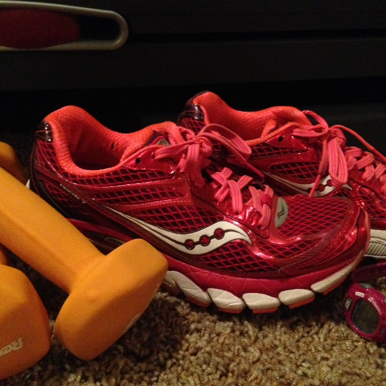
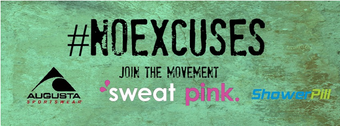
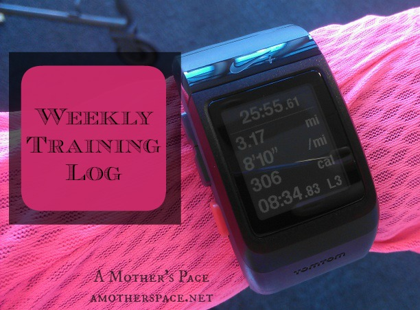
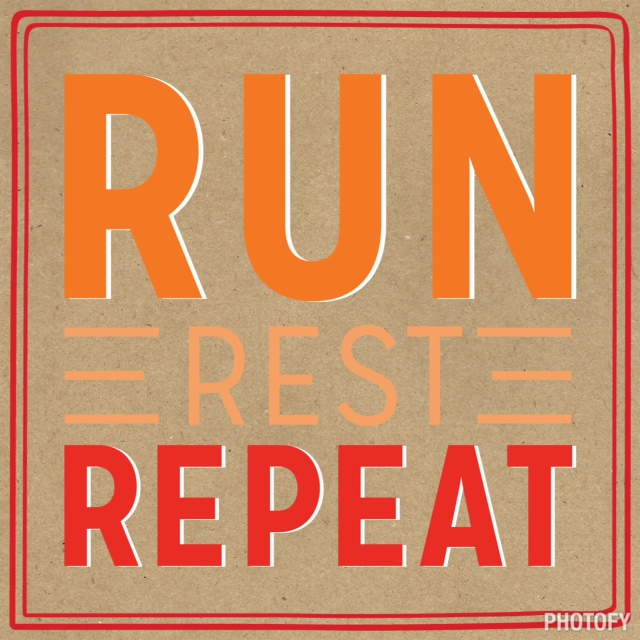
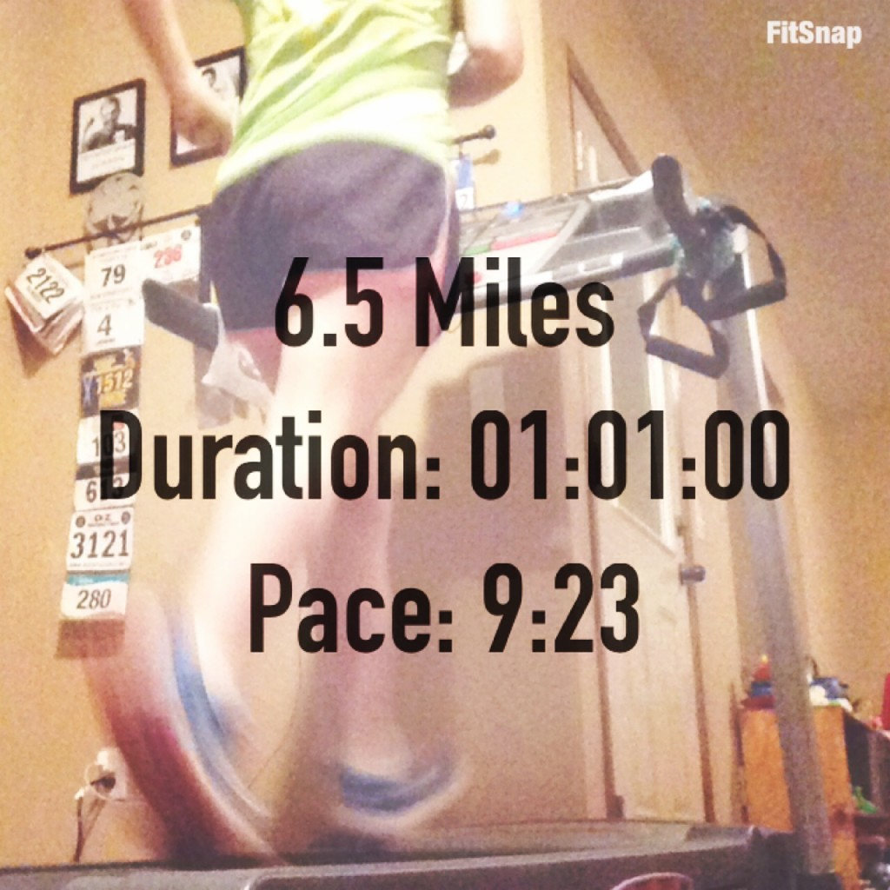

I definitely have had a _No Excuses_ attitude about fitness for the past several years. I create a weekly plan and stick to it for the most part. It's easier when I'm training for a race because I have a goal to meet but lately I've been getting my workouts in even without a race on the calendar.

It's not always easy to wake up early and a lot of the time I want to roll over and turn off the alarm clock BUT I always feel better after getting in my workout of the day.

 

 

The question this week is Why. Why have I chosen to live with No Excuses? The answers are pretty simple but at the same time huge because they are very important to me.

- I feel better when I'm active.
- As a busy mom with three children, exercising has become my 'me' time.
- I want to be a positive role model for my children. I encourage them to make healthy choices including being active.
- I make healthier choices throughout the day when I exercise. This includes drinking enough water. I notice that when I start the day out drinking during my run it usually continues throughout the day.
- I feel stronger when I am strength training regularly. I feel like I can keep up with my kids better.

I'm sure I could keep going with this list but I'll end it there!

This week I also want to send a special shout out to my SweatPink sister, Annmarie over at [The Fit Foodie Mama](http://thefitfoodiemama.com/). She's an inspiring mama of two girls who finds the time to create delicious meals that she shares on her blog. I know because I've made several of her recipes! She also is always doing something fun and unique in her home gym and definitely takes the No Excuses theme to heart as she runs and gets her strength workouts in every week. If you are needing motivation or simply want to follow someone inspirational check out her I[nstagram feed](http://instagram.com/fitfoodiemama).

 

And now for my weekly workouts update. It's the fourth week in 2015 and my miles are close to my 104 mile goal for January!

## **Weekly Workouts**

**Monday:** 3.5 miles (9:27 pace) + 35 minutes Quick Strength for Runners #13

A treadmill run split in half with my strength workout in the middle.

**Tuesday:** 60 minute Spin Bike

Random climb intervals in my workout today.

**Wednesday: 5** miles (9:04 pace)

This treadmill run was mentally tough to get into. I kept trying to talk myself out of running but stuck with it in the end.

**Thursday:** 3.5 miles (9:15 pace) + 25 minutes QSFR #14

I broke up my run with the strength workout again. It's one of my favorite ways to mix running and strength.

**Friday:** 3.1 miles (9:19 pace)

I played around with the buttons a lot on this treadmill run. Jumping up and down between 6.3 and 7 kept me a little distracted.

**Saturday:**  Rest

**Sunday:** 6.5 miles (9:23 pace)

I was really (really, really) hoping for an outside run on the weekend but I chose the treadmill over 45 mph wind gusts.

 

## **Weekly Run This Year Update**

My goal for the year is to race shorter distances but I'm going to Run This Year again in 2015! I've signed up for the 'Run all year and win prizes option' Ha! I'm probably not going to make it past 2,015 kilometers like I did last year but I'm still hoping to get a lot of miles in throughout the year! 2,015 KM is 1,252.06 miles or just 104.34 miles each month.

Weekly Running Miles: 21.6

January Running Miles: 86.75

2015 Running Miles: 86.75

2015 Running Kilometers: 139.61

——————————-

Find A Mother’s Pace on…

Twitter [@amotherspace3](https://twitter.com/amotherspace3)

Facebook [amotherspace3](http://facebook.com/amotherspace3)

Instagram [amotherspace](http://instagram.com/amotherspace)

Pinterest [amotherspace](http://pinterest.com/amotherspace/)

Bloglovin’ [A Mother’s Pace](http://www.bloglovin.com/en/blog/6680087)

RSS [amotherspace](http://feeds.feedburner.com/amotherspace)
