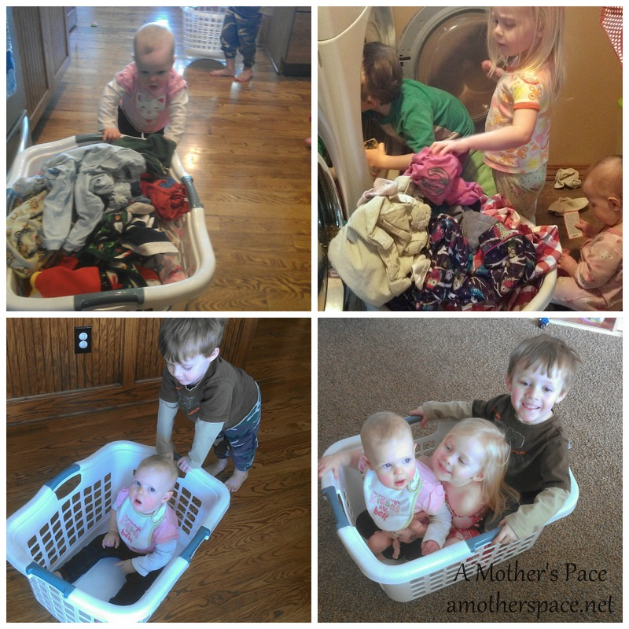
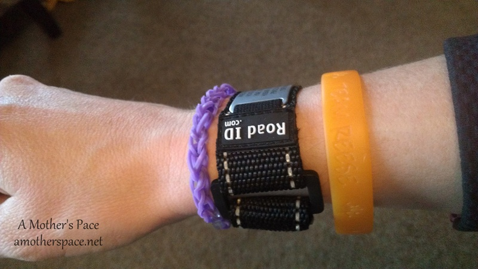
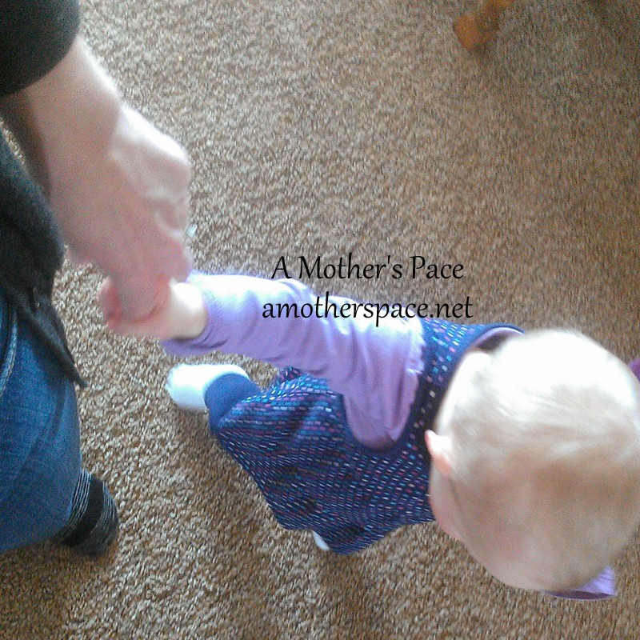

I have a few random thoughts for you on this Thursday so I'm Thinking Out Loud once again.

Thanks for being patient with the new blog changes. The transfer to WordPress went fairly smoothly (with a HUGE thank you to my husband who made this happen!!) and really the only hiccup that we had was transferring over comments from Blogger. My husband figured out the problem though and with a little bit of work we got all the comments moved over.

I apologize to those of you that follow my blog through Feedly. For some reason when I published my first blog post on WordPress, Feedly went back and put several other posts in the feed. Sorry to clog up your fee like that!

This blog continues to be a work in progress. I'm looking at plugins and making updates to the sidebar daily. There's so much that I want to do but only so many hours in the day. It is a slow process but it's moving in the right direction.

 

 

Laundry baskets can be used for many things, why just stop at using them for dirty clothes? Little did I know they were so much fun! I promise that they love helping with laundry and even Little E enjoys going from room to room pushing a basket to fill it up with laundry.

 

 

I'm participating in the #Zoomaphotoaday March contest over on Instagram. Instagram is one of my favorite forms of social media and contests like these are fun because it makes me think about posting things I might not have posted otherwise. It's also fun to see what others do with the same assignment for each day. See more of my photos over on [Instagram](http://instagram.com/amotherspace).

 

 

My Road ID has some company. My orange band I started wearing after my 10 year old niece was diagnosed with leukemia for the second time around. I can't wait for the day that I'm able to cut this off because it will mean she is finally cancer free. I'm also loving my new loom bracelet that my niece made for me. When I run and put on my Road ID it turns out to be quite the stack!

 

 

I love the concentration on Little A's face as she does some cutting for a project at school. She can be very patient when she wants to be!

 

 

I can't get enough of how cute Little E is as she walks around. Usually she is pushing something. A walker, a shoe box, a toy bus, a laundry basket... But she also just likes to hold my hand. We walk slowly around our house, doing laps around the kitchen and living room. I know there is a lot I _could_ be doing but instead I'm slowing down and enjoying this precious milestone with my 12 month old girl.

 

**Do you use a Road ID? Does anyone help you do laundry?**

\-------------------------------

Find A Mother's Pace on...

Twitter [@amotherspace3](https://twitter.com/amotherspace3)

Facebook [amotherspace3](http://facebook.com/amotherspace3)

Instagram [amotherspace](http://instagram.com/amotherspace)

Pinterest [amotherspace](http://pinterest.com/amotherspace/)

Bloglovin' [A Mother's Pace](http://www.bloglovin.com/en/blog/6680087)

RSS [amotherspace](http://feeds.feedburner.com/amotherspace)
