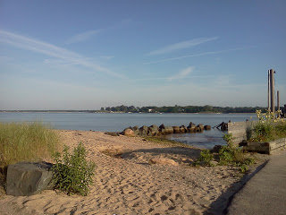
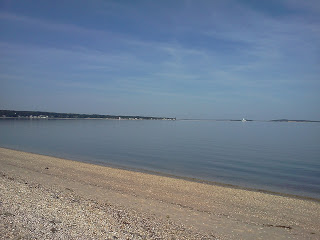
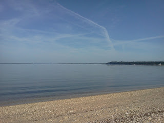
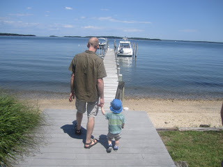
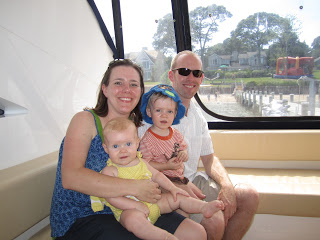
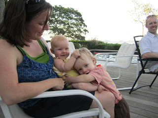

I love to run in a new place and so I usually take my running shoes when I travel. And so Travelin' Tuesdays is born...  
  
  
  
  
My ten miles this weekend made me think about another 10 miler that I thoroughly loved. Last summer I had the wonderful opportunity to visit the Hamptons with my family and my sister for my husbands summer work party. We stayed with his boss in his lovely beach house and enjoyed a wonderful and relaxing long weekend. My run was important this weekend because I was in the middle of training for my first marathon. My plan called for 10 miles and so I pulled out the map and planned my route. I was nervous before the run because I hadn't ran this kind of mileage in over two years but I was happy to have the distraction of a new running environment!  
  
  
  
[View Larger Map](http://maps.google.com/maps?f=q&source=embed&hl=en&geocode=&q=Long+Island,+NY&aq=0&oq=long&sll=41.032622,-72.30669&sspn=0.075881,0.110378&gl=us&ie=UTF8&hq=&hnear=Long+Island&t=m&ll=41.022391,-72.3139&spn=0.045329,0.05991&z=13&iwloc=A)  
  
  
There was a nice wide bike lane that I took North up Ferry Road (are you supposed to run in bike lanes???) with a lot of pretty green trees all around me.  I was very aware of the bikers and I didn't want to get in their way. I always run against the traffic so I can see what is coming towards me but practically all of the other runners were running with traffic. For awhile I wondered if there was some kind of rule about the direction to run. I turned around when I came to the ferry stop and saw the beautiful water.  

  

After turning around and running back down the road I veered off onto a neighborhood street to get off of the busy main street. The houses were all so beautiful. I loved looking at them and all of the landscaping. No pictures though.

  

I headed back to the beach house to make a quick Gatorade stop and refill my handheld water bottle. You have to love technology (I guess) when I can send a text to my husband to ask him to meet me in the drive way with a towel. (It was a lot hotter than I had expected!) I didn't even stop running while texting. I'm amazed I didn't trip or something. 5 miles done!

  

I headed back out after briefly saying "Half way done!" to C.J.'s boss as he drove by in his car.

  

This time I headed South on Ferry Road down to the water. The whole way was down the main road and I continued to run in the bike path. By this time there were more runners out and they were still all running with traffic. I turned around after taking these pictures

  
  

and was in my final stretch back to the house. 

  

At one point I was passed by another runner...Jimmy Buffet was that you? Thank you, Mr. Buffet, for running against the traffic...you made me feel like I wasn't breaking the rules.

  

The run went really well and I was able to get back and relax a little before the party started later on that afternoon.

  

Distance: 10 miles

Time: 2:00:00 

Pace: 12:00

  

<table align="center" cellpadding="0" cellspacing="0"><tbody><tr><td><a href="http://4.bp.blogspot.com/-OEA6y5y-5U0/T3NoGB8QXDI/AAAAAAAAAYM/qB-ZgDv7UPY/s1600/IMG_2656.JPG" imageanchor="1"></a></td></tr><tr><td>A boy and his Daddy.</td></tr></tbody></table>

  
  

<table align="center" cellpadding="0" cellspacing="0"><tbody><tr><td><a href="http://2.bp.blogspot.com/-HbHWENCStCM/T3NoMni47MI/AAAAAAAAAYU/L6wIAEvSC9E/s1600/IMG_2660.JPG" imageanchor="1"></a></td></tr><tr><td>The Hamptons agreed with my sister.</td></tr></tbody></table>

  
  

<table align="center" cellpadding="0" cellspacing="0"><tbody><tr><td><a href="http://4.bp.blogspot.com/-E7MhWFJ_Ch4/T3NoTlAI7FI/AAAAAAAAAYc/zxirR9pbBt8/s1600/IMG_2687.JPG" imageanchor="1"></a></td></tr><tr><td>Family portrait.</td></tr></tbody></table>

  
  

<table align="center" cellpadding="0" cellspacing="0"><tbody><tr><td><a href="http://1.bp.blogspot.com/-A-MneAIfyIg/T3NoaHsdf3I/AAAAAAAAAYk/Wa_wmmBQNYU/s1600/IMG_2704.JPG" imageanchor="1"></a></td></tr><tr><td>Sibling love.</td></tr></tbody></table>
