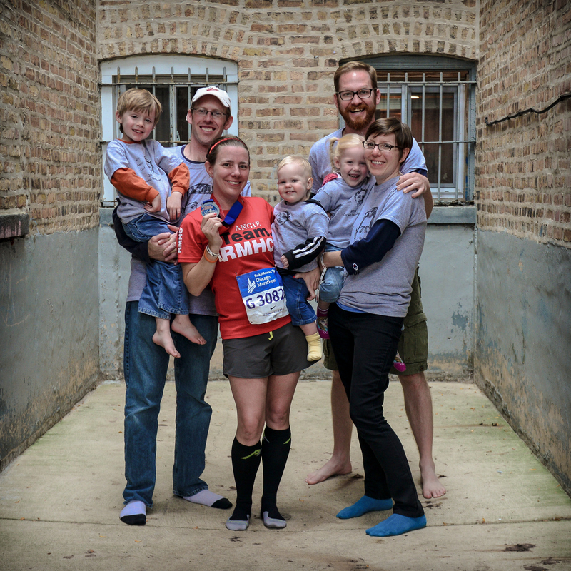
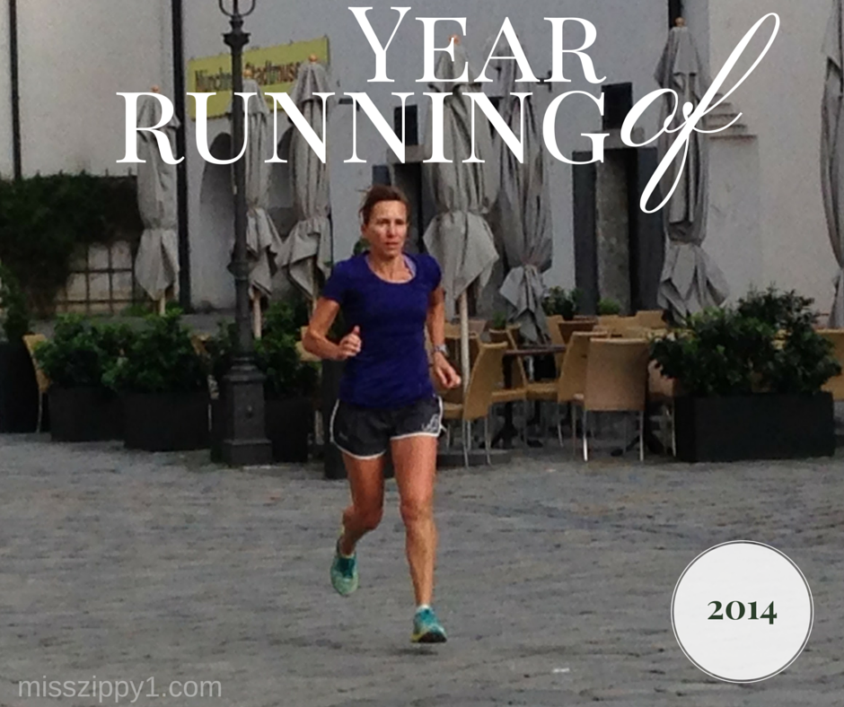

We're almost half way through December and so it's that time of year to reflect on goal setting and reviewing 2014. As in the past 2 years, I'm participating in [Miss Zippy's](http://misszippy1.com/2014/12/year-of-running-2.html) annual running survey. It's a fun little mini recap of my year in running. You can head on over to her website to participate in the link up or read more running surveys.  Missed my other posts? Find them here ---> [2013](http://amotherspace.net/2013/12/how-was-your-year-of-running-a-mini-2013-recap/ "How Was Your Year of Running? A Mini 2013 Recap") and [2012](http://amotherspace.net/2012/12/a-mini-2012-recap/ "A Mini 2012 Recap").

- **Best race experience?** Hands down, my best race experience was the [Chicago Marathon](http://amotherspace.net/2014/10/2014-chicago-marathon-race-recap/ "2014 Chicago Marathon Race Recap"). It was a perfect day that I wish I could relive over and over. The weather was perfect, the crowd was amazing, my support crew was the best and all this came together with months of training to give me a very significant marathon PR.

- **Best run?** Well, if I can't choose the Chicago Marathon for this one I'll choose a different race. I ran a half marathon over the summer that was hilly and on gravel roads during pouring rain. What makes this a 'best run' was the fact that I couldn't wipe the silly grin off my face for most of the race. Even though it was hard, I knew that I was doing something that I love.
- **Best new piece of gear?** I never leave the house for a run without my [FlipBelt](http://amzn.to/1yzI6HD). I used to carry my phone in an armband before this belt because I never run without my phone, mainly for safety reasons. This belt doesn't move or bounce and I didn't really believe that until I tried it.
- **Best piece of running advice you received?** I read [Mind Gym](http://amzn.to/1yRmcOM) this year and it greatly improved the mental side of running for me and even helped me to set new PRs. The best piece of advice came from that book and that is to practice visualizing the run. Mentally watching yourself throughout a run will help to improve the run when it actually happens. I loved this book and I highly recommend reading it if you are struggling to mentally get through difficult workouts.
- **Most inspirational runner?** This year I am going to have to choose Shalane Flanagan. Watching her race the Boston Marathon was so inspirational. She ran an amazing race and reading about her own race experience after the fact showed me what an incredible runner and person she is.
- **If you could sum up your year in a couple of words, what would they be?** Motivated and Miles, lots and lots of miles.

**And now it's your turn. I'd love to hear from you.**

**Pick a question above and answer it in the comments below.** 

- ****

\_\_\_\_\_\_\_\_\_\_\_\_\_\_\_\_\_

I’m running I ran the Chicago Marathon with Team RMHC!

To find out more read my post about [Running for Charity](http://amotherspace.net/2014/06/the-chicago-marathon-running-for-charity/) or head over to my [fundraising page](http://www.kintera.org/faf/donorReg/donorPledge.asp?ievent=1097960&supId=399266070) to make a donation.

——————————-

Find A Mother’s Pace on…

Twitter [@amotherspace3](https://twitter.com/amotherspace3)

Facebook [amotherspace3](http://facebook.com/amotherspace3)

Instagram [amotherspace](http://instagram.com/amotherspace)

Pinterest [amotherspace](http://pinterest.com/amotherspace/)

Bloglovin’ [A Mother’s Pace](http://www.bloglovin.com/en/blog/6680087)

RSS [amotherspace](http://feeds.feedburner.com/amotherspace)
